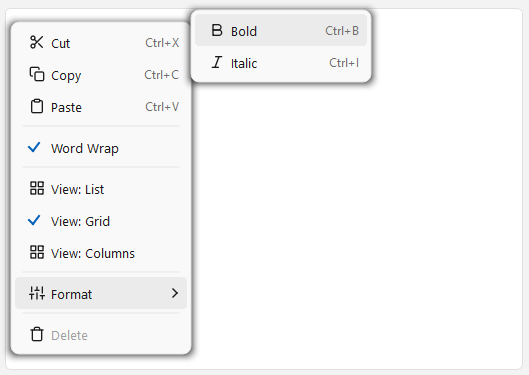
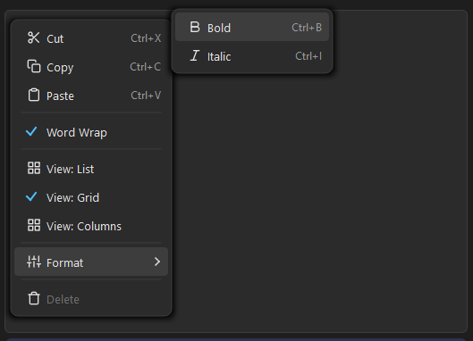
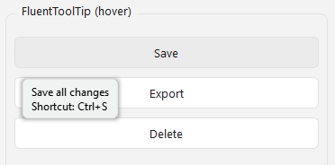
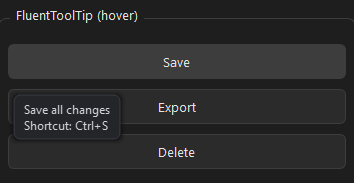

# Fluent Overlays for PySide6

**Disclaimer:** This project is provided as-is, without warranty of any kind. Use it at your own risk. There is no guarantee of continued maintenance, updates, or bug fixes. The author assumes no liability for any issues arising from the use of this code in your projects.

Windows 11 Fluent Design **floating overlays** for PySide6 — a context menu and a tooltip, both built entirely from scratch with frameless translucent popups and `QPainter`-drawn rounded corners + soft shadows. No `QMenu`, no native tooltip, no QSS hacks, no rendering artefacts.


<!--  -->

## Widgets

| File | Class | What it is |
|---|---|---|
| `fluent_context_menu.py` | `FluentContextMenu` | A right-click context menu — icons, shortcuts, checkable & radio items, submenus, keyboard nav |
| `fluent_tooltip.py` | `FluentToolTip` | A translucent hover tooltip that replaces the native Qt one |

Each file is **standalone and single-file** — copy just the one you need. Zero dependencies beyond PySide6.

## Preview
### Context Menu


### Tooltip




## Install

Copy the file(s) you want into your project:

```bash
git clone https://github.com/MaxGroiss/fluent-overlays-pyside6.git
```

**Requires:** PySide6 ≥ 6.7 (tested with 6.10.2), Python ≥ 3.10

## Run the demo

```bash
pip install PySide6
python demo.py
```

Right-click the editor / panel for the context menu, hover the buttons for tooltips, and toggle **Dark Mode** to switch every overlay between light and dark.

---

## FluentContextMenu

A fully custom context menu — **no `QMenu`**. Built from a frameless translucent `QWidget` popup with `QPainter`-drawn rounded corners and a soft drop shadow.

### Why not QMenu?

`QMenu` has well-known issues when styled with QSS:

| Problem | QMenu | This widget |
|---|---|---|
| Rounded corner artefacts | Background bleeds through corners | `QPainter` draws a clean rounded rect |
| Hover highlight | QSS `:hover` is unreliable on items | Per-row `enterEvent`/`leaveEvent` pill |
| Opens only once | Common bug with styled QMenu | Popup flag handles lifecycle correctly |
| Drop shadow | `QGraphicsDropShadowEffect` is slow | Concentric rects, ~0.2 ms paint time |

### Quick start

```python
from fluent_context_menu import FluentContextMenu

menu = FluentContextMenu(dark_mode=True)
menu.add_item("Cut",   shortcut="Ctrl+X", callback=lambda: print("cut"))
menu.add_item("Copy",  shortcut="Ctrl+C", callback=lambda: print("copy"))
menu.add_item("Paste", shortcut="Ctrl+V", callback=lambda: print("paste"))
menu.add_separator()
menu.add_item("Delete", enabled=False)

menu.attach(my_text_edit)   # right-click opens it
```

### Icons

```python
from PySide6.QtGui import QIcon, QColor
from fluent_context_menu import FluentContextMenu, svg_to_icon

menu = FluentContextMenu(dark_mode=True)

# SVG file on disk
menu.add_item("Save", icon=QIcon("icons/save.svg"))

# Inline SVG string, theme-aware via the color parameter
svg = '<svg ... stroke="currentColor" ...>...</svg>'
menu.add_item("Save", icon=svg_to_icon(svg, color=QColor(228, 228, 228)))
```

### Checkable items, radio groups, submenus

```python
# Checkable (toggle on/off)
wrap = menu.add_item("Word Wrap", checkable=True, checked=True)

# Radio group — exactly one checked, never toggles off
menu.add_item("List",    checkable=True, exclusive_group="view")
menu.add_item("Grid",    checkable=True, checked=True, exclusive_group="view")
menu.add_item("Columns", checkable=True, exclusive_group="view")

# Submenu — add_submenu returns a child FluentContextMenu
fmt = menu.add_submenu("Format")
fmt.add_item("Bold",   shortcut="Ctrl+B")
fmt.add_item("Italic", shortcut="Ctrl+I")
```

### Reacting to clicks — three patterns

```python
# 1. Callback (fire-and-forget)
menu.add_item("Save", callback=lambda: document.save())

# 2. Signal (observer)
def on_action(text: str, item_def):
    print(f"{text}, checked={item_def.checked}")
menu.action_triggered.connect(on_action)

# 3. ItemDef reference (read state any time)
grid = menu.add_item("Show Grid", checkable=True, checked=True)
if grid.checked:
    canvas.enable_grid()
```

### Theme switching

```python
menu = FluentContextMenu(dark_mode=False)
menu.dark_mode = True   # popup is rebuilt automatically

# The DARK / LIGHT theme objects are exported for icon colorisation:
from fluent_context_menu import DARK, LIGHT, svg_to_icon
icon = svg_to_icon(svg, color=(DARK if is_dark else LIGHT).icon_color)
```

### API

| Method | Description |
|---|---|
| `add_item(text, *, callback, icon, shortcut, enabled, checkable, checked, exclusive_group)` | Add an item. Returns `MenuItemDef`. |
| `add_separator()` | Add a horizontal line. |
| `add_submenu(text, *, icon)` | Add a submenu. Returns child `FluentContextMenu`. |
| `attach(widget)` / `detach(widget)` | Bind / unbind right-click on a widget. |
| `show_at(global_pos)` | Show programmatically at screen coordinates. |
| `clear()` | Remove all items. |
| `dark_mode` | `bool` property — get/set theme. |
| `action_triggered` | `Signal(str, MenuItemDef)` — emitted on any item click. |

---

## FluentToolTip

A translucent hover tooltip that replaces Qt's native one. Static API — install it on any widget and forget about it.

### Quick start

```python
from fluent_tooltip import FluentToolTip

FluentToolTip.set_dark_mode(True)              # optional, default is light
FluentToolTip.install(save_button, "Save all changes\nShortcut: Ctrl+S")

# Update or remove later
FluentToolTip.set_text(save_button, "Saved!")
FluentToolTip.uninstall(save_button)
```

- Multi-line text supported (just use `\n`).
- Appears after a ~0.5 s hover delay, auto-hides after a few seconds.
- Suppresses the native Qt tooltip on installed widgets.
- Flips above the widget instead of running off the bottom of the screen.

### API

| Method | Description |
|---|---|
| `FluentToolTip.install(widget, text)` | Attach a fluent tooltip to a widget. |
| `FluentToolTip.set_text(widget, text)` | Change the text of an installed tooltip. |
| `FluentToolTip.uninstall(widget)` | Remove the tooltip from a widget. |
| `FluentToolTip.set_dark_mode(bool)` | Switch all tooltips between light and dark. |

---

## License

MIT — do whatever you want. See [LICENSE](LICENSE).
